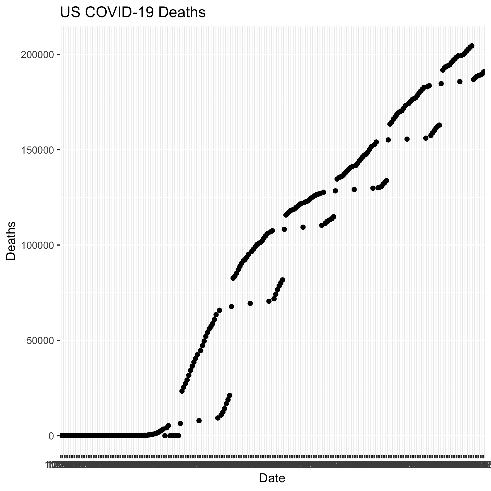

```{r}
library(tidyverse)
library(lubridate)
```

```{r echo=FALSE}
ts_confirmed_long <- read_csv(url("https://raw.githubusercontent.com/CSSEGISandData/COVID-19/master/csse_covid_19_data/csse_covid_19_time_series/time_series_covid19_confirmed_global.csv")) %>% 
  rename(Province_State = "Province/State", Country_Region = "Country/Region") %>% 
  pivot_longer(-c(Province_State, Country_Region, Lat, Long), 
               names_to = "Date", values_to = "Confirmed") %>% 
  unite(Key, Country_Region, Province_State, Date, sep = ".", remove = FALSE )
```

```{r}
ts_deaths_long <- read_csv(url("https://raw.githubusercontent.com/CSSEGISandData/COVID-19/master/csse_covid_19_data/csse_covid_19_time_series/time_series_covid19_deaths_global.csv")) %>%
  rename(Province_State = "Province/State", Country_Region = "Country/Region") %>% 
  pivot_longer(-c(Province_State, Country_Region, Lat, Long), 
               names_to = "Date", values_to = "Deaths") %>% 
  unite(Key, Country_Region, Province_State, Date, sep = ".") %>% 
  select(Key, Deaths)
```

# Join tables

```{r}
ts_long_joined <- full_join(ts_confirmed_long,
    ts_deaths_long, by = c("Key")) %>% 

  select(-Key)
```

# Reformat the Data 
```{r}
ts_long_joined$Date <- mdy(ts_long_joined$Date)
```

# Create Report Table with Counts
```{r}
ts_long_joined_counts <- ts_long_joined %>% 
  pivot_longer(-c(Province_State, Country_Region, Lat, Long, Date),
                              names_to = "Report_Type", values_to = "Counts")
```

# Plot graph to a pdf outputfile

```{r}
pdf("ts_long_joined_image.pdf", width = 6, height = 3)
ts_long_joined %>% 
  group_by(Country_Region,Date) %>% 
  summarise_at(c("Confirmed", "Deaths"), sum) %>% 
  filter (Country_Region == "US") %>% 
    ggplot(aes(x = Date,  y = Deaths)) + 
    geom_point() +
    geom_line() +
    ggtitle("US COVID-19 Deaths")
dev.off()
```


# Inserting Images


 
```{r}
library(plotly)
ggplotly(
  ts_long_joined %>% 
    group_by(Country_Region,Date) %>% 
    summarise_at(c("Confirmed", "Deaths"), sum) %>% 
    filter (Country_Region == "US") %>% 
    ggplot(aes(x = Date,  y = Deaths)) + 
      geom_point() +
      geom_line() +
      ggtitle("US COVID-19 Deaths")
 )
```


```{r}
US_deaths <- ts_long_joined %>% 
    group_by(Country_Region,Date) %>% 
    summarise_at(c("Confirmed", "Deaths"), sum) %>% 
    filter (Country_Region == "US")
 p <- ggplot(data = US_deaths, aes(x = Date,  y = Deaths)) + 
        geom_point() +
        geom_line() +
        ggtitle("US COVID-19 Deaths")
 ggplotly(p)
```

```{r}
library(gganimate)
library(transformr)
theme_set(theme_bw())
```

```{r}
data_time <- ts_long_joined %>% 
    group_by(Country_Region,Date) %>% 
    summarise_at(c("Confirmed", "Deaths"), sum) %>% 
    filter (Country_Region %in% c("China","Korea, South","Japan","Italy","US")) 
p <- ggplot(data_time, aes(x = Date,  y = Confirmed, color = Country_Region)) + 
      geom_point() +
      geom_line() +
      ggtitle("Confirmed COVID-19 Cases") +
      geom_point(aes(group = seq_along(Date))) +
      transition_reveal(Date) 
animate(p, end_pause = 15)
```

