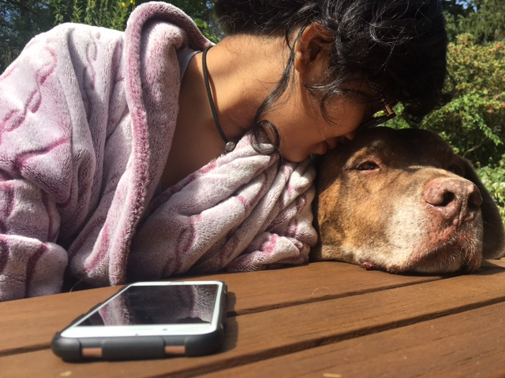

```{r setup, include=FALSE}
knitr::opts_chunk$set(echo = TRUE)
```

Welcome to my page! My name is Manya Vivek. I'm a Biology undergrad at UMass Amherst. This page is for my Evolutionary Genomics and Bininformatics lab. 

 


[ClickHere](Seals.mp4)
- A video of seals swimming close to the shore in Cape cod (08/08/2020). I feel fortunate to have seen them swim and I'm glad I recorded it. 


### LAB SUBMISSIONS: 

1.
[Lab1 - Introduction to R and Reproducible Research](Lab1_ManyaVivek.html)

2.
[Lab2 - git, GitHub and R studio projects](Lab2_ManyaVivek.html)

3. Lab3
- [Lab3A - Starting with data](Lab3A_ManyaVivek.html)

- [Lab3B - Manipulating data](Lab3B_ManyaVivek.html)

4. 
[Lab4 - Data wrangling and graphing COVID-19 reporting data (Part 1)](Lab4_ManyaVivek.html)

5. 
[lab5 - Data wrangling and graphing COVID-19 reporting data (Part 2)](Lab5_ManyaVivek.html)


